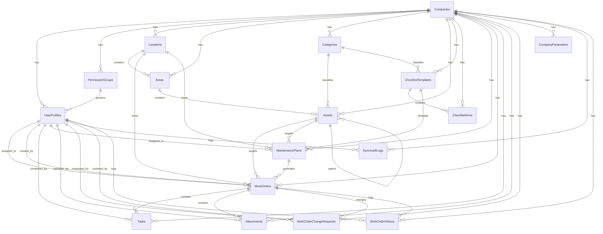

# ServicePro Database Schema Reference

This document provides a comprehensive overview of the database schema for the ServicePro CMMS, detailing both the local Drift (SQLite) tables and the remote Supabase (PostgreSQL) source of truth.

---

## Entity Relationship Diagram (ERD)

---

## Data Dictionary

### 1. companies
Root multi-tenant table representing client companies.

| Column | Type | Nullability | Default | Description |
|---|---|---|---|---|
| `id` | UUID (Text) | NOT NULL | - | Primary Key |
| `name` | TEXT | NOT NULL | - | Company name |
| `cnpj` | TEXT | NULL | - | Brazilian CNPJ |
| `logo_url` | TEXT | NULL | - | URL to company logo |
| `is_active` | BOOLEAN | NOT NULL | true | System status toggle |
| `created_at` | TIMESTAMP | NOT NULL | now() | Record creation date |
| `updated_at` | TIMESTAMP | NOT NULL | now() | Record update date |
| `deleted_at` | TIMESTAMP | NULL | - | Soft delete flag |

### 2. permission_groups
Replaces static roles with customizable, company-specific permission groups.

| Column | Type | Nullability | Default | Description |
|---|---|---|---|---|
| `id` | UUID (Text) | NOT NULL | - | Primary Key |
| `company_id` | UUID (Text) | NOT NULL | - | Foreign Key -> `companies.id` (Cascade) |
| `name` | TEXT | NOT NULL | - | Name of the role (e.g. Técnico, Gestor) |
| `permissions` | JSONB (Text) | NOT NULL | '[]' | List of permission codes/strings |
| `is_default` | BOOLEAN | NOT NULL | false | Indicates system-provided group |
| `created_at` | TIMESTAMP | NOT NULL | now() | Record creation date |
| `deleted_at` | TIMESTAMP | NULL | - | Soft delete flag |

### 3. user_profiles
Extended profile details mapping to Supabase authenticated users.

| Column | Type | Nullability | Default | Description |
|---|---|---|---|---|
| `id` | UUID (Text) | NOT NULL | - | Primary Key (matches Supabase Auth uid) |
| `company_id` | UUID (Text) | NOT NULL | - | Foreign Key -> `companies.id` (Cascade) |
| `name` | TEXT | NOT NULL | - | User display name |
| `email` | TEXT | NOT NULL | - | User email |
| `phone` | TEXT | NULL | - | User contact number |
| `permission_group_id` | UUID (Text) | NULL | - | Foreign Key -> `permission_groups.id` (Set Null) |
| `avatar_url` | TEXT | NULL | - | URL to user avatar image |
| `is_active` | BOOLEAN | NOT NULL | true | Active status toggle |
| `is_admin` | BOOLEAN | NOT NULL | false | Administrative privileges flag |
| `created_at` | TIMESTAMP | NOT NULL | now() | Record creation date |
| `updated_at` | TIMESTAMP | NOT NULL | now() | Record update date |
| `deleted_at` | TIMESTAMP | NULL | - | Soft delete flag |

### 4. locations
Facilities/sites managed by a company.

| Column | Type | Nullability | Default | Description |
|---|---|---|---|---|
| `id` | UUID (Text) | NOT NULL | - | Primary Key |
| `company_id` | UUID (Text) | NOT NULL | - | Foreign Key -> `companies.id` (Cascade) |
| `name` | TEXT | NOT NULL | - | Facility name (Unique per company) |
| `address` | TEXT | NULL | - | Full street address |
| `city` | TEXT | NULL | - | City location |
| `state` | TEXT | NULL | - | State code |
| `is_active` | BOOLEAN | NOT NULL | true | Status toggle |
| `created_at` | TIMESTAMP | NOT NULL | now() | Record creation date |
| `updated_at` | TIMESTAMP | NOT NULL | now() | Record update date |
| `deleted_at` | TIMESTAMP | NULL | - | Soft delete flag |

### 5. areas
Internal zones or rooms within a location.

| Column | Type | Nullability | Default | Description |
|---|---|---|---|---|
| `id` | UUID (Text) | NOT NULL | - | Primary Key |
| `location_id` | UUID (Text) | NOT NULL | - | Foreign Key -> `locations.id` (Cascade) |
| `company_id` | UUID (Text) | NOT NULL | - | Foreign Key -> `companies.id` (Cascade) |
| `name` | TEXT | NOT NULL | - | Name of the zone (e.g., Sala 102) |
| `floor` | TEXT | NULL | - | Floor index/level |
| `description` | TEXT | NULL | - | Specific zone details |
| `created_at` | TIMESTAMP | NOT NULL | now() | Record creation date |
| `updated_at` | TIMESTAMP | NOT NULL | now() | Record update date |
| `deleted_at` | TIMESTAMP | NULL | - | Soft delete flag |

### 6. categories
Equipment categories to organize assets.

| Column | Type | Nullability | Default | Description |
|---|---|---|---|---|
| `id` | UUID (Text) | NOT NULL | - | Primary Key |
| `company_id` | UUID (Text) | NOT NULL | - | Foreign Key -> `companies.id` (Cascade) |
| `name` | TEXT | NOT NULL | - | Category label (Unique per company) |
| `description` | TEXT | NULL | - | Category details |
| `color` | TEXT | NULL | - | Tag color code for UI |
| `created_at` | TIMESTAMP | NOT NULL | now() | Record creation date |
| `deleted_at` | TIMESTAMP | NULL | - | Soft delete flag |

### 7. assets
Equipment or physical property items requiring maintenance.

| Column | Type | Nullability | Default | Description |
|---|---|---|---|---|
| `id` | UUID (Text) | NOT NULL | - | Primary Key |
| `company_id` | UUID (Text) | NOT NULL | - | Foreign Key -> `companies.id` (Cascade) |
| `area_id` | UUID (Text) | NOT NULL | - | Foreign Key -> `areas.id` (Cascade) |
| `category_id` | UUID (Text) | NULL | - | Foreign Key -> `categories.id` (Set Null) |
| `parent_asset_id` | UUID (Text) | NULL | - | Self reference for nested sub-assets (Set Null) |
| `name` | TEXT | NOT NULL | - | Equipment description |
| `code` | TEXT | NULL | - | Unique system code (Unique per company) |
| `manufacturer` | TEXT | NULL | - | Manufacturer brand |
| `model` | TEXT | NULL | - | Manufacturer model |
| `serial_number` | TEXT | NULL | - | Manufacturer serial (Unique per company) |
| `install_date` | DATE (DateTime) | NULL | - | Asset installation date |
| `warranty_expiration` | DATE (DateTime) | NULL | - | Warranty end date |
| `revision_forecast` | DATE (DateTime) | NULL | - | Predicted next revision date |
| `status` | TEXT | NOT NULL | 'active' | active / inactive / decommissioned |
| `criticality` | TEXT | NOT NULL | 'medium'| low / medium / high / mission_critical |
| `notes` | TEXT | NULL | - | Additional notes |
| `created_at` | TIMESTAMP | NOT NULL | now() | Record creation date |
| `updated_at` | TIMESTAMP | NOT NULL | now() | Record update date |
| `deleted_at` | TIMESTAMP | NULL | - | Soft delete flag |

### 8. checklist_templates
Pre-configured checklists for inspections.

| Column | Type | Nullability | Default | Description |
|---|---|---|---|---|
| `id` | UUID (Text) | NOT NULL | - | Primary Key |
| `company_id` | UUID (Text) | NOT NULL | - | Foreign Key -> `companies.id` (Cascade) |
| `name` | TEXT | NOT NULL | - | Template name |
| `description` | TEXT | NULL | - | Details of inspection |
| `category_id` | UUID (Text) | NULL | - | Foreign Key -> `categories.id` (Set Null) |
| `created_at` | TIMESTAMP | NOT NULL | now() | Record creation date |
| `updated_at` | TIMESTAMP | NOT NULL | now() | Record update date |
| `deleted_at` | TIMESTAMP | NULL | - | Soft delete flag |

### 9. checklist_items
Specific items/checks linked to a `checklist_template`.

| Column | Type | Nullability | Default | Description |
|---|---|---|---|---|
| `id` | UUID (Text) | NOT NULL | - | Primary Key |
| `template_id` | UUID (Text) | NOT NULL | - | Foreign Key -> `checklist_templates.id` (Cascade) |
| `company_id` | UUID (Text) | NOT NULL | - | Foreign Key -> `companies.id` (Cascade) |
| `label` | TEXT | NOT NULL | - | Inspection question/instruction |
| `type` | TEXT | NOT NULL | 'boolean' | boolean / text / number / photo / selection |
| `is_required` | BOOLEAN | NOT NULL | false | Required toggle |
| `options` | JSONB (Text) | NULL | - | Options array for 'selection' types |
| `sort_order` | INT | NOT NULL | 0 | Positional sort index |
| `created_at` | TIMESTAMP | NOT NULL | now() | Record creation date |
| `deleted_at` | TIMESTAMP | NULL | - | Soft delete flag |

### 10. maintenance_plans
Schedules defining automated work order generation.

| Column | Type | Nullability | Default | Description |
|---|---|---|---|---|
| `id` | UUID (Text) | NOT NULL | - | Primary Key |
| `company_id` | UUID (Text) | NOT NULL | - | Foreign Key -> `companies.id` (Cascade) |
| `asset_id` | UUID (Text) | NULL | - | Foreign Key -> `assets.id` (Set Null) |
| `location_id` | UUID (Text) | NULL | - | Foreign Key -> `locations.id` (Set Null) |
| `title` | TEXT | NOT NULL | - | Plan title |
| `description` | TEXT | NULL | - | Detailed plan summary |
| `frequency` | TEXT | NOT NULL | - | daily / weekly / biweekly / monthly etc. |
| `day_of_week` | INT | NULL | - | Day index (1-7) for weekly |
| `day_of_month` | INT | NULL | - | Day (1-31) for monthly |
| `month_of_year` | INT | NULL | - | Month (1-12) for annual |
| `checklist_template_id` | UUID (Text) | NULL | - | Foreign Key -> `checklist_templates.id` (Set Null) |
| `assigned_to_id` | UUID (Text) | NULL | - | Foreign Key -> `user_profiles.id` (Set Null) |
| `priority` | TEXT | NOT NULL | 'medium' | low / medium / high / critical |
| `is_active` | BOOLEAN | NOT NULL | true | Status toggle |
| `last_generated_at`| TIMESTAMP | NULL | - | Last automatic generation execution |
| `next_due_date` | TIMESTAMP | NULL | - | Next predicted due timestamp |
| `created_at` | TIMESTAMP | NOT NULL | now() | Record creation date |
| `updated_at` | TIMESTAMP | NOT NULL | now() | Record update date |
| `deleted_at` | TIMESTAMP | NULL | - | Soft delete flag |

### 11. work_orders
Actual instances of preventive, corrective or inspection tasks.

| Column | Type | Nullability | Default | Description |
|---|---|---|---|---|
| `id` | UUID (Text) | NOT NULL | - | Primary Key |
| `company_id` | UUID (Text) | NOT NULL | - | Foreign Key -> `companies.id` (Cascade) |
| `asset_id` | UUID (Text) | NULL | - | Foreign Key -> `assets.id` (Set Null) |
| `location_id` | UUID (Text) | NOT NULL | - | Foreign Key -> `locations.id` (Cascade) |
| `assigned_to_id` | UUID (Text) | NULL | - | Foreign Key -> `user_profiles.id` (Set Null) |
| `created_by_id` | UUID (Text) | NOT NULL | - | Foreign Key -> `user_profiles.id` (Cascade) |
| `maintenance_plan_id` | UUID (Text) | NULL | - | Foreign Key -> `maintenance_plans.id` (Set Null) |
| `title` | TEXT | NOT NULL | - | Summary of issue or task |
| `description` | TEXT | NULL | - | Specific descriptions |
| `priority` | TEXT | NOT NULL | 'medium'| low / medium / high / critical |
| `status` | TEXT | NOT NULL | 'open' | open / in_progress / on_hold / completed etc. |
| `type` | TEXT | NOT NULL | 'corrective'| corrective / preventive / inspection |
| `scheduled_date` | TIMESTAMP | NULL | - | Date for planned execution |
| `started_at` | TIMESTAMP | NULL | - | Work start time |
| `completed_at` | TIMESTAMP | NULL | - | Work completion time |
| `estimated_duration`| INT | NULL | - | Planned minutes |
| `actual_duration` | INT | NULL | - | Total minutes spent |
| `labor_cost` | REAL (Numeric) | NULL | - | Assigned labor costs |
| `parts_cost` | REAL (Numeric) | NULL | - | Replacement parts cost |
| `total_cost` | REAL (Numeric) | NULL | - | Total labor + parts |
| `notes` | TEXT | NULL | - | Closing notes / technician remarks |
| `created_at` | TIMESTAMP | NOT NULL | now() | Record creation date |
| `updated_at` | TIMESTAMP | NOT NULL | now() | Record update date |
| `deleted_at` | TIMESTAMP | NULL | - | Soft delete flag |

### 12. tasks
Subtasks/steps checklist inside a single `work_order`.

| Column | Type | Nullability | Default | Description |
|---|---|---|---|---|
| `id` | UUID (Text) | NOT NULL | - | Primary Key |
| `work_order_id` | UUID (Text) | NOT NULL | - | Foreign Key -> `work_orders.id` (Cascade) |
| `company_id` | UUID (Text) | NOT NULL | - | Foreign Key -> `companies.id` (Cascade) |
| `title` | TEXT | NOT NULL | - | Subtask title |
| `description` | TEXT | NULL | - | Specific instruction detail |
| `is_completed` | BOOLEAN | NOT NULL | false | Complete toggle |
| `completed_at` | TIMESTAMP | NULL | - | Completion timestamp |
| `completed_by_id` | UUID (Text) | NULL | - | Foreign Key -> `user_profiles.id` (Set Null) |
| `sort_order` | INT | NOT NULL | 0 | Positional sort index |
| `created_at` | TIMESTAMP | NOT NULL | now() | Record creation date |
| `updated_at` | TIMESTAMP | NOT NULL | now() | Record update date |
| `deleted_at` | TIMESTAMP | NULL | - | Soft delete flag |

### 13. attachments
Document links and photos captured offline and synchronized online.

| Column | Type | Nullability | Default | Description |
|---|---|---|---|---|
| `id` | UUID (Text) | NOT NULL | - | Primary Key |
| `work_order_id` | UUID (Text) | NOT NULL | - | Foreign Key -> `work_orders.id` (Cascade) |
| `company_id` | UUID (Text) | NOT NULL | - | Foreign Key -> `companies.id` (Cascade) |
| `uploaded_by_id` | UUID (Text) | NOT NULL | - | Foreign Key -> `user_profiles.id` (Cascade) |
| `file_name` | TEXT | NOT NULL | - | Physical name on local storage |
| `file_type` | TEXT | NOT NULL | - | image / pdf / document / signature |
| `local_path` | TEXT | NULL | - | App sandbox local file path |
| `remote_url` | TEXT | NULL | - | Cloudflare R2 public URL |
| `file_size_bytes` | INT | NULL | - | File size metric |
| `is_compressed` | BOOLEAN | NOT NULL | false | Compressed flag (Images only) |
| `upload_status` | TEXT | NOT NULL | 'pending' | pending / uploaded / failed |
| `created_at` | TIMESTAMP | NOT NULL | now() | Record creation date |
| `deleted_at` | TIMESTAMP | NULL | - | Soft delete flag |

### 14. work_order_change_requests
Queue holding proposed changes to finalized/closed work orders.

| Column | Type | Nullability | Default | Description |
|---|---|---|---|---|
| `id` | UUID (Text) | NOT NULL | - | Primary Key |
| `work_order_id` | UUID (Text) | NOT NULL | - | Foreign Key -> `work_orders.id` (Cascade) |
| `company_id` | UUID (Text) | NOT NULL | - | Foreign Key -> `companies.id` (Cascade) |
| `requested_by_id` | UUID (Text) | NOT NULL | - | Foreign Key -> `user_profiles.id` (Cascade) |
| `change_type` | TEXT | NOT NULL | - | add_task / add_attachment / update_notes etc. |
| `change_data` | JSONB (Text) | NOT NULL | - | JSON serialized payload of edit request |
| `status` | TEXT | NOT NULL | 'pending' | pending / approved / rejected |
| `reviewed_by_id` | UUID (Text) | NULL | - | Foreign Key -> `user_profiles.id` (Set Null) |
| `rejection_reason` | TEXT | NULL | - | Rejection description |
| `created_at` | TIMESTAMP | NOT NULL | now() | Record creation date |
| `updated_at` | TIMESTAMP | NOT NULL | now() | Record update date |
| `deleted_at` | TIMESTAMP | NULL | - | Soft delete flag |

### 15. company_parameters
Configuration limits governing client offline allowances.

| Column | Type | Nullability | Default | Description |
|---|---|---|---|---|
| `id` | UUID (Text) | NOT NULL | - | Primary Key |
| `company_id` | UUID (Text) | NOT NULL | - | Foreign Key -> `companies.id` (Cascade, Unique) |
| `max_offline_duration_hours` | INT | NOT NULL | 2 | Alert limit: hours offline |
| `max_offline_pending_requests` | INT | NOT NULL | 10 | Alert limit: pending queue size |
| `created_at` | TIMESTAMP | NOT NULL | now() | Record creation date |
| `updated_at` | TIMESTAMP | NOT NULL | now() | Record update date |
| `deleted_at` | TIMESTAMP | NULL | - | Soft delete flag |

### 16. sync_audit_logs
Audited records documenting synchronizer operations.

| Column | Type | Nullability | Default | Description |
|---|---|---|---|---|
| `id` | UUID (Text) | NOT NULL | - | Primary Key |
| `company_id` | UUID (Text) | NOT NULL | - | Foreign Key -> `companies.id` (Cascade) |
| `user_profile_id` | UUID (Text) | NOT NULL | - | Foreign Key -> `user_profiles.id` (Cascade) |
| `entity_type` | TEXT | NOT NULL | - | Table name of synchronized model |
| `entity_id` | UUID (Text) | NOT NULL | - | Id of synchronized entity |
| `operation` | TEXT | NOT NULL | - | insert / update / delete |
| `synced_at` | TIMESTAMP | NOT NULL | now() | Execution timestamp |

### 17. work_order_history
Audited tracking records capturing work order lifecycle updates.

| Column | Type | Nullability | Default | Description |
|---|---|---|---|---|
| `id` | UUID (Text) | NOT NULL | - | Primary Key |
| `work_order_id` | UUID (Text) | NOT NULL | - | Foreign Key -> `work_orders.id` (Cascade) |
| `company_id` | UUID (Text) | NOT NULL | - | Foreign Key -> `companies.id` (Cascade) |
| `user_id` | UUID (Text) | NOT NULL | - | Foreign Key -> `user_profiles.id` (Cascade) |
| `action` | TEXT | NOT NULL | - | Event classification (e.g. status_change) |
| `old_value` | TEXT | NULL | - | Field value prior to update |
| `new_value` | TEXT | NULL | - | Field value post update |
| `created_at` | TIMESTAMP | NOT NULL | now() | Timestamp of log event |

---

## Remote Security & RLS (Supabase Only)

Row Level Security, soft deletion triggers, and relational deletion constraints are configured on the database. For detailed information, SQL definitions, and implementation patterns, see [Database Global Rules](file:///Users/mattheus/Development/Projects/ServiceProviders/docs/database/global_rules.md).
