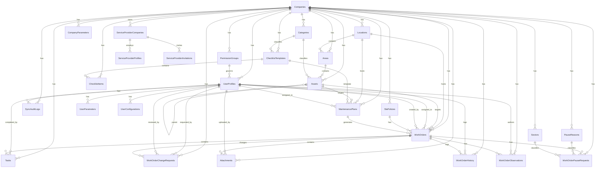

# ServicePro Database Schema

## Common Columns

All tables share these columns (omitted from individual files):

| Column | Type | Nullability | Default |
|---|---|---|---|
| `id` | UUID | NOT NULL | PK |
| `company_id` | UUID | NOT NULL | FK → `companies.id` (Cascade) |
| `created_at` | TIMESTAMP | NOT NULL | now() |
| `updated_at` | TIMESTAMP | NOT NULL | now() |
| `deleted_at` | TIMESTAMP | NULL | Soft delete |

**Exceptions**: `companies` has no `company_id`. `sync_audit_logs` and `work_order_history` have no `updated_at`/`deleted_at`. `user_parameters` uses `user_profile_id` instead of `company_id`. `categories` and `checklist_items` have no `updated_at`. `user_configurations` uses `user_id` as PK (no `id`, no `company_id`, no `deleted_at`).

---

## Entity Relationship Diagram

---

## Tables

| # | Table | File |
|---|---|---|
| 1 | companies | [companies.md](companies.md) |
| 2 | permission_groups | [permission_groups.md](permission_groups.md) |
| 3 | user_profiles | [user_profiles.md](user_profiles.md) |
| 4 | locations | [locations.md](locations.md) |
| 5 | areas | [areas.md](areas.md) |
| 6 | categories | [categories.md](categories.md) |
| 7 | assets | [assets.md](assets.md) |
| 8 | checklist_templates | [checklist_templates.md](checklist_templates.md) |
| 9 | checklist_items | [checklist_items.md](checklist_items.md) |
| 10 | maintenance_plans | [maintenance_plans.md](maintenance_plans.md) |
| 11 | work_orders | [work_orders.md](work_orders.md) |
| 12 | tasks | [tasks.md](tasks.md) |
| 13 | attachments | [attachments.md](attachments.md) |
| 14 | work_order_change_requests | [work_order_change_requests.md](work_order_change_requests.md) |
| 15 | company_parameters | [company_parameters.md](company_parameters.md) |
| 16 | user_parameters | [user_parameters.md](user_parameters.md) |
| 17 | sync_audit_logs | [sync_audit_logs.md](sync_audit_logs.md) |
| 18 | work_order_history | [work_order_history.md](work_order_history.md) |
| 19 | sla_policies | [sla_policies.md](sla_policies.md) |
| 20 | work_order_pause_requests | [work_order_pause_requests.md](work_order_pause_requests.md) |
| 21 | pause_reasons | [pause_reasons.md](pause_reasons.md) |
| 22 | sectors | [sectors.md](sectors.md) |
| 23 | work_order_observations | [work_order_observations.md](work_order_observations.md) |
| 24 | service_provider_companies | [service_provider_companies.md](service_provider_companies.md) |
| 25 | service_provider_profiles | [service_provider_profiles.md](service_provider_profiles.md) |
| 26 | service_provider_invitations | [service_provider_invitations.md](service_provider_invitations.md) |
| 27 | user_configurations | [user_configurations.md](user_configurations.md) |
| 28 | user_device_tokens | [user_device_tokens.md](user_device_tokens.md) |
| 29 | sync_errors | [sync_errors.md](sync_errors.md) |

---

## Remote Security & RLS (Supabase Only)

See [Database Global Rules](/docs/database_rules/global_rules.md).
